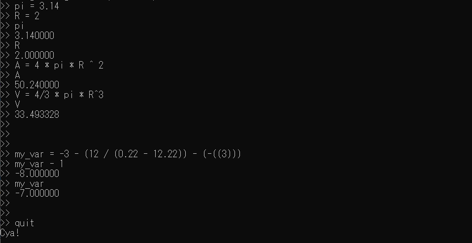

# Simple-interpreter
## About
A simple command-line interpreter. It supports multi-character variables and these operators: ``` + - * / % ^ ( ) ```. \
All variables are of type double. This implementation uses Pratt Parsing algorithm.

## How to build
```shell
# Clone the repository
git clone https://github.com/Sett-0/Simple-interpreter.git
# If you on linux, use gcc or clang:
g++ main.cpp lexer.cpp expr.cpp -o main
# If you on windows, use MSVC compiler. In Developer Command Prompt:
cl /EHsc main.cpp lexer.cpp expr.cpp
# Or create a project in Visual Studio and run it from there. 
```

## Usage example


## Reference
Reference video of the similar implementation (written in rust): [here](https://youtu.be/0c8b7YfsBKs?si=OLEiQl4x1ElJLElW).
